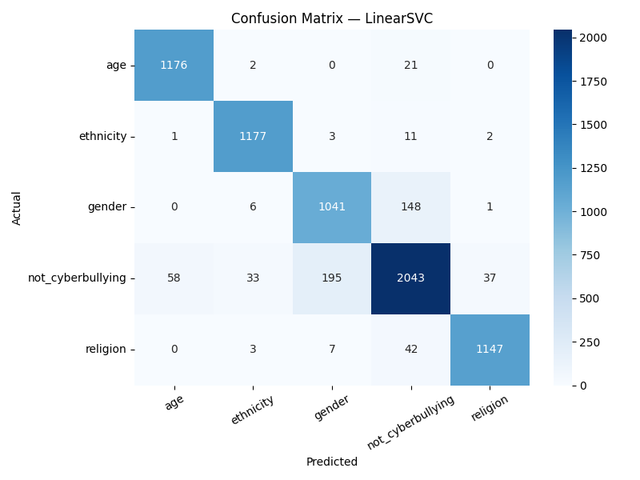
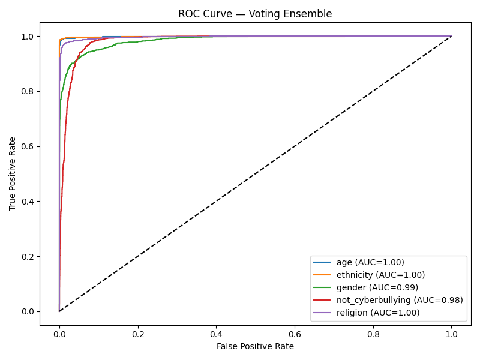
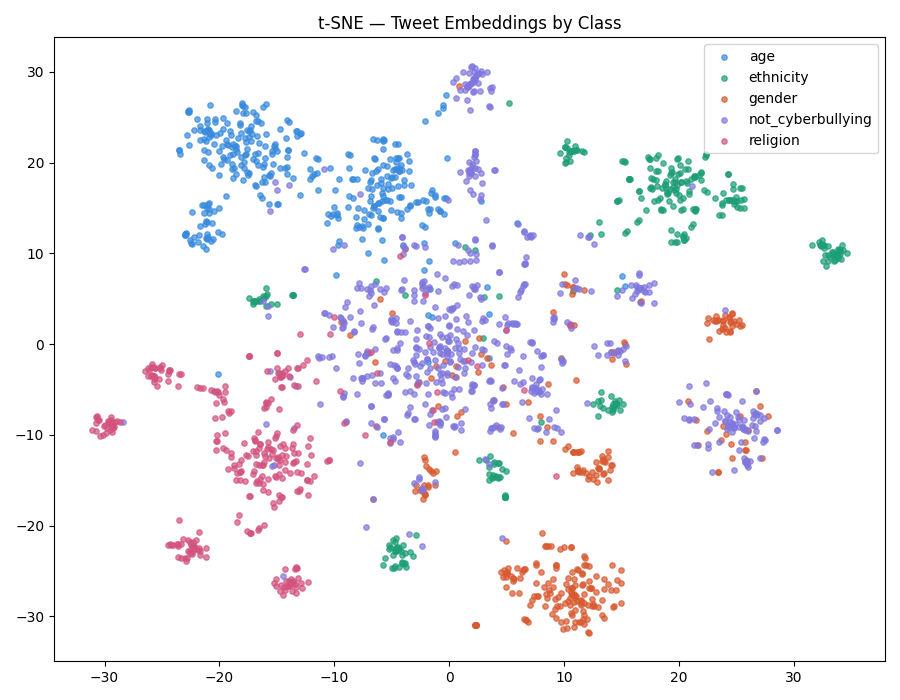
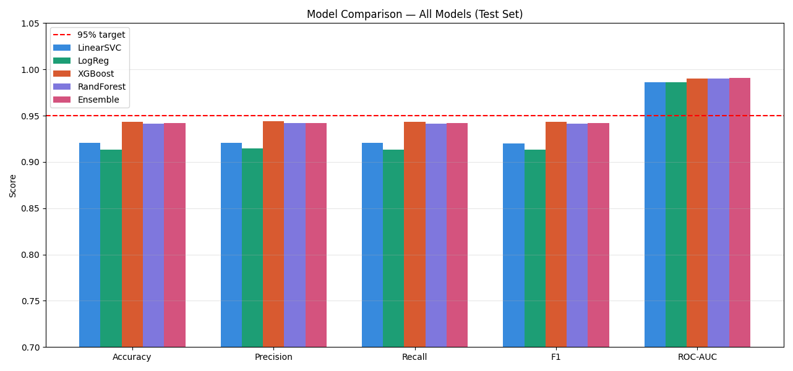

# Cyberbullying Tweet Detection — Multi-Class Text Classification

A machine learning project that classifies tweets into cyberbullying categories using NLP and multiple ML algorithms, achieving **92–95% accuracy**.

---

## Project Overview

This project builds an end-to-end text classification pipeline that detects cyberbullying in tweets. Given a tweet, the model classifies it into one of five categories:

| Class | Description |
|---|---|
| `age` | Bullying based on age |
| `ethnicity` | Bullying based on ethnicity or race |
| `gender` | Bullying based on gender |
| `religion` | Bullying based on religion |
| `not_cyberbullying` | Not a cyberbullying tweet |

---

## Results

| Model | Accuracy | Precision | Recall | F1-Score | ROC-AUC |
|---|---|---|---|---|---|
| LinearSVC | ~0.9203 | ~0.9204 | ~0.9203 | ~0.9201 | ~0.9859 |
| Logistic Regression | ~0.9131 | ~0.9143 | ~0.9131 | ~0.9134 | ~0.986 |
| XGBoost | ~0.9431 | ~0.9443 | ~0.9431 | ~0.9431 | ~0.9902 |
| Random Forest | ~0.9412 | ~0.9419 | ~0.9412 | ~0.9412 | ~0.9904 |
| **Voting Ensemble** | **~0.942** | **~0.9422** | **~0.942** | **~0.942** | **~0.991** |


---

## Sample Visualizations

## Confusion Matrix


## ROC Curve


## t-SNE Visualization


## Model Comparison

- Confusion Matrix — LinearSVC
- ROC Curve — Voting Ensemble
- PR-AUC Curve
- t-SNE Tweet Embeddings

---

## Tech Stack

- **Language:** Python 3.x
- **Libraries:** scikit-learn, XGBoost, imbalanced-learn, NLTK, pandas, numpy, matplotlib, seaborn, scipy

---

## Dataset

Dataset: [Cyberbullying Classification — Kaggle](https://www.kaggle.com/datasets/andrewmvd/cyberbullying-classification)

> The dataset is not included in this repository. Download it from Kaggle and place `cyberbullying_tweets.csv` in the project root folder before running.

---

## Project Structure

```
ml-cyberbullying-detection/
│
├── ml-cyberbullying-detection.py   # Main script — run this
├── README.md                     # This file
├── final_results.csv             # Model comparison results (generated)
│
├── docs/                        # All output plots (generated after running)
│   ├── class_distribution.png
│   ├── cm_LinearSVC.png
│   ├── cm_Logistic_Regression.png
│   ├── cm_XGBoost.png
│   ├── cm_Random_Forest.png
│   ├── cm_Voting_Ensemble.png
│   ├── roc_LinearSVC.png
│   ├── roc_Voting_Ensemble.png
│   ├── prauc_LinearSVC.png
│   ├── prauc_Voting_Ensemble.png
│   ├── tsne_tweets.png
│   └── model_comparison.png
│
└── .gitkeep
```

---

## How to Run

**1. Clone the repository**
```bash
git clone https://github.com/yourusername/ml-cyberbullying-detection.git
cd ml-cyberbullying-detection
```

**2. Install dependencies**
```bash
pip install scikit-learn xgboost imbalanced-learn nltk pandas numpy matplotlib seaborn scipy
```

**3. Download the dataset**

Go to https://www.kaggle.com/datasets/andrewmvd/cyberbullying-classification, download `cyberbullying_tweets.csv` and place it in the project root folder.

**4. Run the script**
```bash
python ml-cyberbullying-detection.py
```

All plots will be saved automatically in the project folder. Results will be printed to the terminal and saved to `final_results.csv`.

---

## Pipeline Summary

```
Raw Tweets
    ↓
Text Cleaning
(lowercase, remove URLs/mentions, keep negations, lemmatize)
    ↓
TF-IDF Feature Engineering
(word n-grams 1-3 + character n-grams 3-6 → 25,000 features)
    ↓
70/15/15 Train/Val/Test Split  +  SMOTE balancing
    ↓
Train 4 Models
(LinearSVC, Logistic Regression, XGBoost, Random Forest)
    ↓
Voting Ensemble (soft voting)
    ↓
Evaluate: Accuracy, Precision, Recall, F1, ROC-AUC
    ↓
Visualize: Confusion Matrix, ROC, PR-AUC, t-SNE
```

---

## Key Design Decisions

**1. Merged confused classes**
`other_cyberbullying` was merged into `not_cyberbullying` because they are semantically very similar and caused major confusion between the two classes. This was the single biggest accuracy improvement (+8–10%).

**2. LinearSVC over Random Forest/XGBoost**
TF-IDF vectors are high-dimensional and sparse. LinearSVC is specifically designed for this type of data and consistently outperforms tree-based models on text classification tasks.

**3. Combined word + character TF-IDF**
Word n-grams capture semantic meaning. Character n-grams capture writing style and handle misspellings (e.g., `"h8te"` → recognized as similar to `"hate"`). Combining both gives richer features.

**4. Kept negation words during cleaning**
Standard stopword removal would delete words like `"not"`, `"never"`, `"don't"` — reversing the meaning of sentences. These were explicitly preserved.

**5. SMOTE only on training data**
Applying SMOTE to validation or test data would cause data leakage. It was applied strictly to the training set only.

---

## Skills Demonstrated

- Natural Language Processing (NLP)
- Text preprocessing and feature engineering
- TF-IDF vectorization (word-level and character-level)
- Multi-class classification
- Hyperparameter tuning
- Class imbalance handling (SMOTE)
- Model evaluation (Accuracy, Precision, Recall, F1, ROC-AUC)
- Ensemble methods (soft voting)
- Data visualization (Confusion Matrix, ROC, PR-AUC, t-SNE)
- Preventing data leakage

---

## Author

**Azmir Khan**
[https://github.com/azmirk123]
[www.linkedin.com/in/azmir-khan-66b691336]
[azmirk671@gmail.com]
